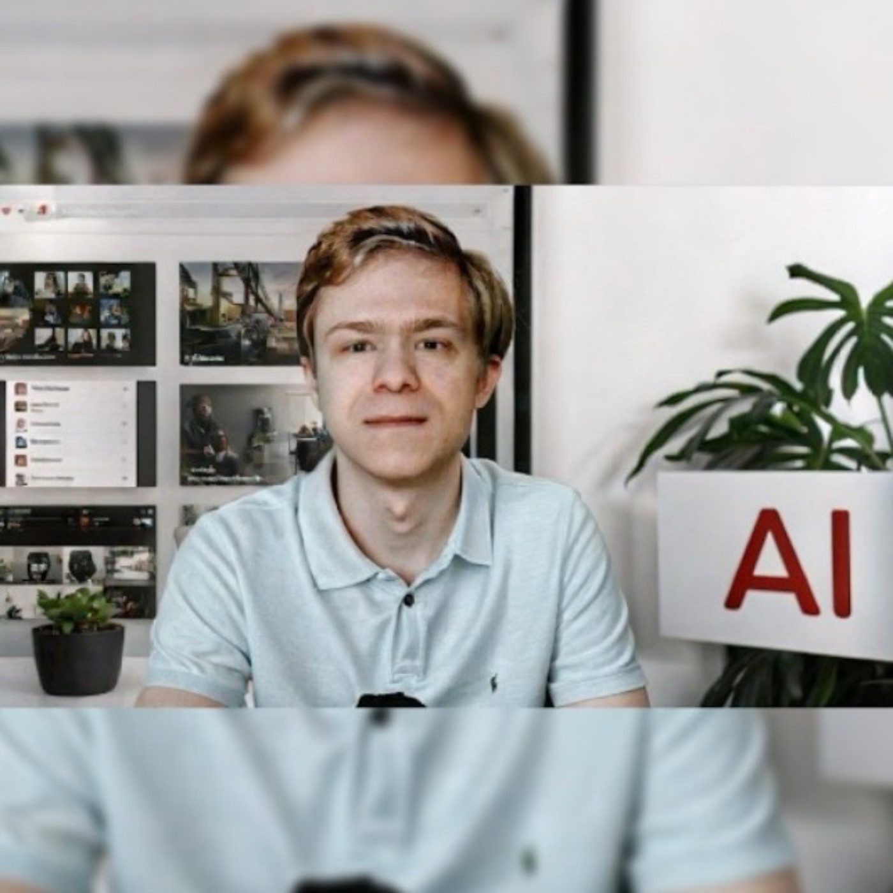

Подкаст **"Фриланс 2026: Полный курс для начинающих"** — от фриланса к **фричайзингу**. Гибридная модель масштабирования без вложений: запускаем франшизы, JS-виджеты, ботов и веб-инструменты для вашей ниши.

**В комплекте**: шаблоны, скрипты, чеклисты для быстрого внедрения.

## Ключевые темы выпусков

- **Стратегия фричайзинга 2025-2026**  
  Масштаб через соцсети и контент-воронки. Создаём сеть партнёров-фрилансеров под брендом с пассивным доходом от их лидов.

- **Telegram Ads в Европе**  
  Запуск рекламы, бесплатный трафик, воронки продаж для фрилансеров.

- **Сообщество Beautiful People**  
  Превращаем идеи в реальность с AI, нейросетями и бизнес-моделями.

## Практические кейсы слушателей

| Результат | Инструменты | Срок |
|-----------|-------------|-------|
| API веб-виджет | GitHub Actions, лендинги | 2 месяца |
| 3 партнёра из СПб | Email-воронки с AI | 2 месяца |

> "Показываю на своём примере: фриланс = гибкость + дисциплина + обучение в разных странах." — Семён Федосеев

## Где слушать (3 выпуска, без VPN)

- [Mave.digital](https://freechising.mave.digital)  
- [Podster.fm](https://podster.fm/user/freechising)  

**Внедряйте шаблоны → пассивный рост → глобальный рынок.**

---

#UI #Карьера #Мнение
